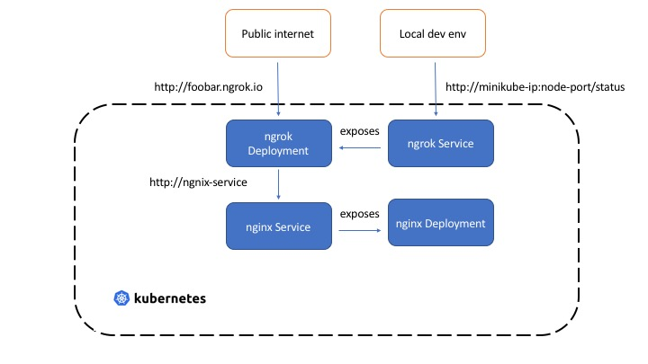

# Ngrok Kubernetes Helm Chart

This is a modified version of [ngrok-kubernetes](https://github.com/abhirockzz/ngrok-kubernetes) aimed at easily exposing ngrok in local [minikube](https://kubernetes.io/docs/setup/minikube/) clusters. The [original author](https://github.com/abhirockzz) has published a blog post explaining how it works [here](https://medium.com/@abhishek1987/expose-kubernetes-services-with-ngrok-65280142dab4).

# Example

There's an example in [nginx-example](charts/nginx-examples) using a [requirements.yaml](charts/nginx-examples/requirements.yaml) on using the kubernetes provider in another helm chart

## Configuration

| Parameter        | Description                   | Default                                                    |
|------------------|-------------------------------|------------------------------------------------------------|
| image.repository | ngrok docker image            | [wernight/ngrok](https://hub.docker.com/r/wernight/ngrok/) |
| image.tag        | nginx tag                     | latest                                                     |
| image.pullPolicy | image pull policy             | IfNotPresent                                               |
| ports.container  | nginx container port          | 4040                                                       |
| ports.service    | nginx service port            | 4040                                                       |
| env              | list of enviornment variables | none                                                       |

## Enviornment variables

For available enviornment variables, please see the [ngrok container docs](https://hub.docker.com/r/wernight/ngrok/)

## Get the nrok url

*Note: you can get around this by using a constant subdomain via an enviornment variable:

kubectl exec $(kubectl get pods -l=app=nginx-example-ngrok-ingress -o=jsonpath='{.items[0].metadata.name}') -- curl http://localhost:4040/api/tunnels
